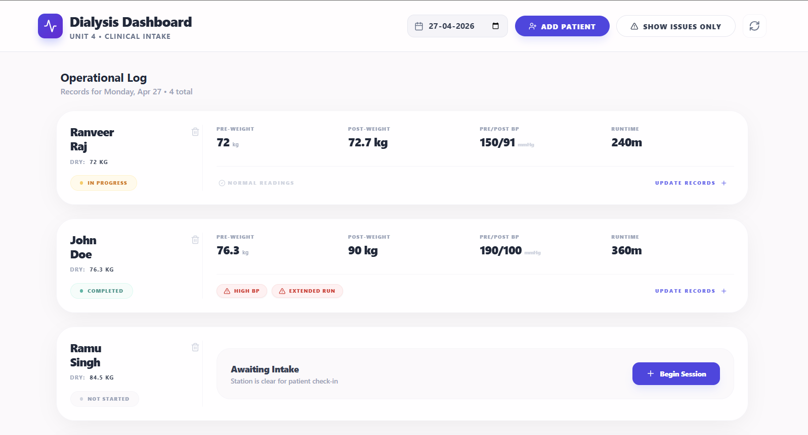

# Dialysis Tracker Dashboard



A professional, full-stack clinical dashboard (Express + React + MongoDB) designed for dialysis units to track patient sessions and automatically detect safety anomalies in real-time.

---

## 🚀 Core Features

### 🏥 Clinical Workflow
- **Real-time Session Tracking**: Monitor active dialysis sessions (Pre-weight, Post-weight, BP, and Runtime).
- **Manual Patient Registration**: Nurses can register new patients directly from the dashboard if they are not pre-assigned.
- **Patient Management**: Full control to add or delete patients from the clinical log.

### 🔍 Safety & Anomaly Detection
- **Automatic Alerts**: The system automatically detects and flags:
  - **High IDWG**: Interdialytic Weight Gain > 5% of dry weight.
  - **Hypertension**: Post-dialysis Systolic BP > 160 mmHg.
  - **Session Variance**: Sessions shorter than 3 hours or longer than 5 hours.
- **Visual Warnings**: Clinical issues are highlighted with red alerts for immediate nurse attention.

### 📅 Data Management
- **Historical Records**: Use the integrated Date Picker to view session logs from any previous date.
- **Strict Date Visibility**: Patients only appear on dates relevant to their registration or treatment, keeping the daily log clean.
- **Live Sync**: Refresh data instantly without reloading the page.

### 🎨 Premium UI/UX
- **Compact Card Design**: Optimized layout to fit multiple patient records on a single screen.
- **Responsive Interface**: Works seamlessly on clinic tablets and desktop monitors.
- **Glassmorphic Aesthetics**: Modern, clean design using Tailwind CSS and Lucide icons.

---

## 🏗 Project Architecture

```text
Dialysis_Dashboard/
├── backend/
│   ├── src/
│   │   ├── models/           # Mongoose Schemas (Patient, Session)
│   │   ├── routes/           # Express API Endpoints
│   │   ├── utils/            # Clinical Rules Engine (Anomaly Detection)
│   │   └── index.ts          # Server Entry Point
│   └── package.json          # Node.js dependencies & scripts
├── frontend/
│   ├── src/
│   │   ├── components/       # Reusable UI (AddPatient, AddSession modals)
│   │   ├── api.ts            # Axios configuration & API functions
│   │   ├── App.tsx           # Main Dashboard Logic & Layout
│   │   └── index.css         # Global styles & design system
│   └── package.json          # Vite & React configuration
└── README.md                 # Project documentation
```

---

## ⚙️ Setup Instructions

### Prerequisites
- **Node.js** (v18+)
- **MongoDB** (Local or Atlas)

### Backend Setup
1. `cd backend`
2. `npm install`
3. Create a `.env` file with `MONGO_URI` (optional, defaults to local).
4. `npm run seed` (to populate initial patient data).
5. `npm run dev` (Starts on `http://localhost:5000`).

### Frontend Setup
1. `cd frontend`
2. `npm install`
3. `npm run dev` (Starts on `http://localhost:5173`).

---

---

## ✅ Project Deliverables

- [x] **Running Service**: Full-stack API and UI active.
- [x] **Seed Script**: Integrated `npm run seed` to populate mock patients.
- [x] **Architecture Overview**: Detailed in the "Project Architecture" section above.
- [/] **API Documentation**: Markdown-based documentation available (see below).
- [x] **Tests**:
    - [x] Core business logic (anomaly detection).
    - [x] API route validation.
    - [x] UI component unit test.

---

## 📖 API Documentation

### Patients
- `GET /api/patients` - Fetch all patients.
- `POST /api/patients` - Register a new patient.
- `DELETE /api/patients/:id` - Remove a patient.

### Sessions
- `GET /api/sessions/schedule?date=YYYY-MM-DD` - Fetch sessions for a specific date.
- `POST /api/sessions` - Start/Record a new session.
- `PATCH /api/sessions/:id` - Update an existing session record.
